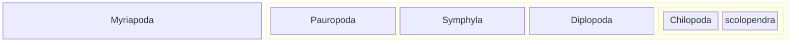

*[#fb4934]:Unterstamm
<b>Myriapoda</b>
(Tausendfüßer);

**[#d3869b]:Klasse
<b>Pauropoda</b>
(Wenigfüßer);
**[#d3869b]:Klasse
<b>Symphyla</b>
(Zwergfüßer);
**[#d3869b]:Klasse
<b>Diplopoda</b>
(Doppelfüßer);

**[#d3869b]:Klasse
<b>Chilopoda</b>
(Hundertfüßer);