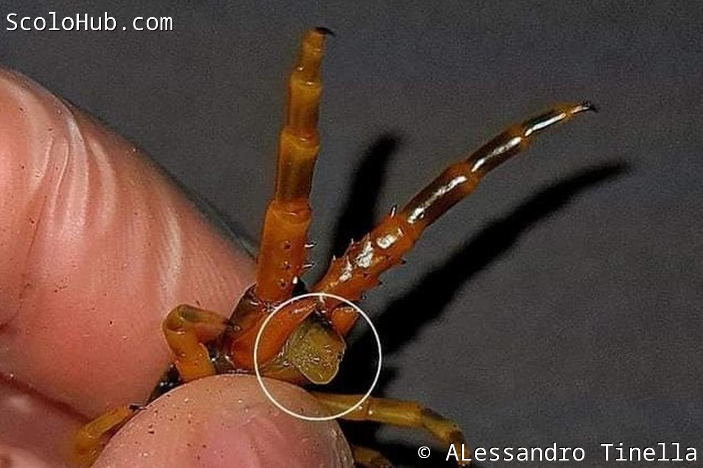
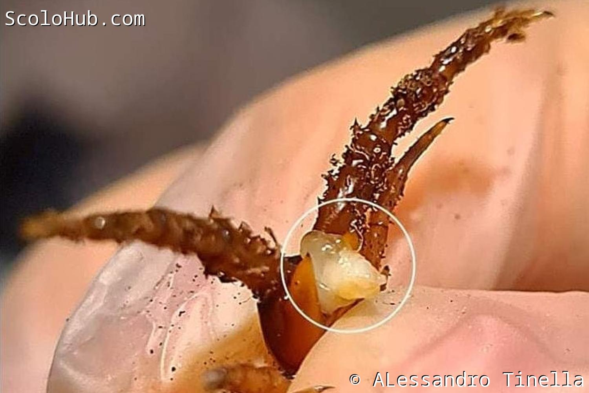

# Ethmostigmus trigonopodus pygomenasoides

## Über die Art

Die Erstbeschreibung von Ethmostigmus trigonopodus pygomenasoides wurde für Tiere aus der Region Nepal und Kashmir angefertigt. Die Art heißt so, weil sie Ethmostigmus pygomegas ähnlich sieht. Doch insgesamt ist sie morphologisch näher an Etmostimus trigonopodus, weshalb sie als Unterart geführt wird.  Jiang, et all (2022) nennt Ethmostigmus pygomenasoides als eigenständige Art in einem Nachweis aus China. Aktuell scheint noch offen, ob es sich wirklich um eine Unterart von Ethmostigmus trigonopodus (mit Verbreitung in Afrika) handelt, oder ob die asiatischen Tiere eine eigenständige Art darstellen.

Ethmostigmus pygomenasoides ist eine langsam wachsende Art. Von der Nymphe bis zum adulten Tier vergehen sechs Jahre. Dabei haben männchen eine deutlich geringere Lebenserwartung, werden in der Regel gerade mal 3 Jahre alt und erreichen bis dahin eine Körpergröße von etwa 10cm.

Eine Verpaarung der Art erfolgt entsprechend relativ früh in einem subadultem Stadium mit ca. 2-3 Jahren Alter. Nach der Verpaarung speichern die Weibchen das Sperma für weitere drei Jahre bis zum Adultstadium und legen ab dann jährlich Eier. Adulte Tiere verpaaren sich nicht mehr und reagieren aggressiv auf männliche Artgenossen.

**Ausgewachsene Größe**: 10cm (m) / 18cm (w)  
**Herkunft**: Nigeria / China, Nepal, Kashmir  
**Klimazone**: subtropisch  
**Lebensweise**: bodenbewohnend  
**Verhalten**: relativ ruhig  
**Sexualdimorphismus**: nein  
**Anspruch in der Terrarienhaltung**: einfach  
**Verfügbarkeit im Hobby**: gut verfügbar

## Haltungsparameter

**Terrarien-Größe (LxBxH)**: 40×30×30cm  
**Belüftung**: Doppelbelüftung  
**Temperaturbereich**: 22-34°C  
**rel. Luftfeuchtigkeit**: 50-90% (abhängig von Regenzeiten)  
**Simulation von Jahreszeiten / Regenzeiten notwendig**: ja  

**Substrat**:

- **Zusammensetzung**: Humus
- **Substrathöhe**: 10cm hoch leicht angedrückt
- **Substratfeuchtigkeit**: angepasst an aride und humide Monate des Herkunftlandes, eine Ecke permanent leicht feucht.
- **Bodenbedeckung**: Moos, Laub

**Terrarien-Einrichtung**: eine Versteckmöglichkeit (z.B: Korkrinde) und eine Wasserschale muss gegeben sein.

**Ernährung**:

- Ausgewogene Ernährung durch Wirbellose.

## Geschlechtsunterscheidung



Weibliche Geschlechtsorgane von E. pygomenasoides  
Foto von: 

<--->

Männliche Geschlechtsorgane von E. pygomenasoides  
Foto von: 



## Bilder



---
Von: 
* 
* 
