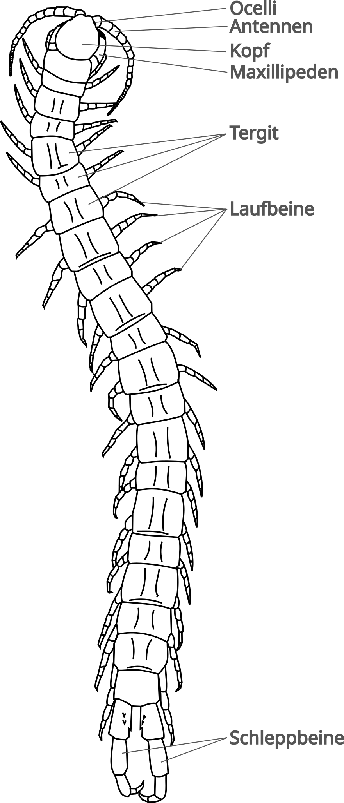
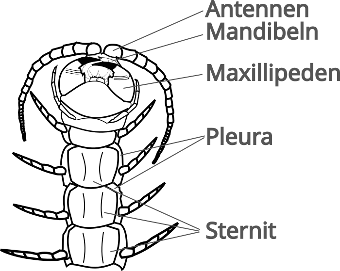
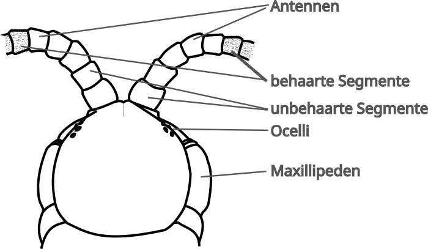
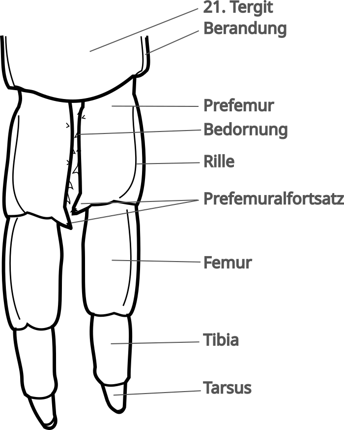
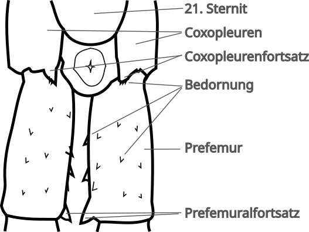

# Skolopender

## Die Klasse Chilopoda

**Chilopoda** (Hundertfüßer) sind neben Pauropoda (Wenigfüßer), Symphyla (Zwergfüßer) und Diplopoda (Doppelfüßer) eine Klasse der **Myriapoda** (Vielfüßer). Dabei ist der Name Skolopender eher ein Sammelbegriff für Riesenläufer im Allgemeinen und bezieht sich nicht ausschließlich auf die Gattung Scolopendra; vielmehr versteht man darunter Tiere der Ordnung Scolopendromporpha.

Unter den Chilopoda gibt es insgesamt fünf Ordnungen:

- **Scutigeromorpha** (Spinnenläufer)
- **Lithobiomorpha** (Steinläufer)
- **Craterostigmomorpha** (Eine endemische Ordnung, die nur in Neuseeland und Tasmanien vorkommt)
- **Geophilomorpha** (Erdläufer)
- **Scolopendromorpha** (Riesenläufer)

Derweil findet man in ganz Deutschland viele Arten der Lithobiomorpha und Geophilomorpha in Garten und Wald, während man Tiere aus den Ordnungen Scutigeromorpha und auch Scolopendromorpha nur in einzelnen Regionen nachweisen kann. Wer sich mehr für die einheimischen Hundertfüßer interessiert, bekommt auf der Webseite [bodentierhochvier.de](https://bodentierhochvier.de/) weitere Informationen.

## Die Ordnung Scolopendromorpha

Die Arten der Ordnung Scolopendromorpha sind vielgestaltig. Die kleinsten Arten messen gerade mal 10mm, derweil die größten deutlich über 30cm werden können. Meist haben Scolopendromorpha 4 Ocelli (Augen) auf jeder Seite. Es gibt aber auch Familien, die keine Ocelli besitzen und die kleinste Familie **Mimopidae** mit der Gattung **Mimpos**, die lediglich ein Auge auf jeder Seite haben.

Auch die Anzahl der Beinpaare kann innerhalb der Ordnung variieren. Derweil die meisten Arten 21 Beinpaare besitzen, hat der Genus **Scolopendropsis** in der Regel 23 Beinpaare. Doch auch hier gibt es eine Ausnahme: [**Scolopendropsis duplicata**](https://www.theguardian.com/science/2010/apr/18/new-to-nature-scolopendropsis-duplicata) hat eine variable Anzahl von 39 bis 43 Beinpaaren.

### Übersicht über die Familien der Ordnung Scolopendromorpha

- Familie **Scolopocryptopidae**
  - Unterfamilie **Scolopocryptopinae**
  - Unterfamilie **Kethopinae**
  - Unterfamilie **Newportiinae**
- Familie **Cryptopidae**
- Familie **Mimopidae**
- Familie **Scolopendridae**
  - Unterfamilie **Scolopendrinae**
  - Unterfamilie **Otostigminae**
    - Stamm: **Otostigmini**
    - Stamm: **Sterropristini**

Es gibt dazu noch ehemalige Stämme von **Scolopendrini**, **Asanadini** und **Arrhabdotini**, deren Status und Gattungen aktuell diskutiert werden.[^1]

## Die Familie Scolopendridae

In der Terraristik sind die bekanntesten Skolopender aus der Familie der Scolopendridae. Darum an dieser Stelle ein Überblick über die Unterfamilien, Stämme und Gattungen dieser Familie.[^1]

### Gattungen der Familie Scolopendridae

Unterfamilie **Scolopendrinae**

- Gattung **Scolopendra**
- Gattung **Arthrorhabdus**
- Gattung **Tonkinodentus**
- Gattung **Cormocephalus**
- Gattung **Hemiscolopendra**
- Gattung **Akymnopellis**
- Gattung **Psiloscolopendra**
- Gattung **Notiasemus**
- Gattung **Scolopendropsis**

Unterfamilie **Otostigminae**

- Stamm **Otostigmini**
  - Gattung **Otostigmus**
  - Gattung **Digitipes**
  - Gattung **Alipes**
  - Gattung **Ethmostigmus**
  - Gattung **Rhysida**
  - Gattung **Alluropus**
- Stamm **Sterropristini**
  - Gattung **Sterropristes**

In der Terraristik stammen die meisten Tiere aus den Gattungen Scolopendra, Cormocephalus, Alipes, Ethmostigmus und Rhysida. Doch zuweilen findet man auch schon mal andere Gattungen wie Otostigmus.

## Externe Anatomie


An dieser Stelle wird _nur_ auf die externe Anatomie von Skolopendern eingegangen, da die interne Anatomie sehr komplex und meist für den Hobby-Halter wenig relevant ist.


Skolopender haben einen schlanken bis mäßig gedrungenen Körper, der sich in im Verhältnis zwischen Länge zu Breite zwischen Lithobiomorpha und Geophilomorpha befindet.  Die kleinsten Arten sind ca. 10mm, derweil die größten Arten deutlich über 30cm werden können.  Die Anzahl von Segmenten und Beinpaaren ist konstant. Die meisten Skolopender haben 21 Beinpaare. Dabei entspringt aus jedem Körpersegment ein Beinpaar, was den Unterschied zu den Diplopoda ausmacht, die verbundene Segmente haben, aus denen jeweils 2 Beinpaare entspringen.

Der Kopf eines Skolopenders besteht aus dem dorsalen **Kopfschild** und den ventralen **Clypeus** (_Stirnplatte_) und dem **Kopfpleurit**. Vorne befinden sich die **Antennen**, deren Grundglieder häufig kahl sind. Meist bestehen die Antennen aus 17 kugelförmigen Gliedern. Seitlich vorne, etwas hinter den Antennen, befinden sich die 4 **Ocellen** (_Augen_).
Ventral befinden sich am Kopf die **Mandibeln** (zum _Mundwerkzeug_ umgewandeltes 3. Beinpaar) und **Maxillen** (_Mundwerkzeuge_). Diese sind meist von den **Maxillipeden** (_Kieferfüße_) überdeckt. Diese vermeintlichen Mundwerkzeuge sind umgewandelte Beine, in denen auch die Giftdrüsen von Skolopendern sitzen. Ein "Biss" ist eigentlich kein Biss im wörtlichen Sinne, sondern ein "Greifen" mit den Giftklauen.

Die **Maxillipeden** werden nicht zu den Beinpaaren gezählt. Neben den 20 Laufbeinen haben Skolopender als 21. Beinpaar die sogenannten **Schleppläufe** oder Endbeine, die nicht zur Fortbewegung dienen. Sie erfüllen andere Zwecke, wie Feindabwehr oder auch Kommunikation in der Paarung. Manche Arten verfügen über sogenannte Autonomie und können die Schleppbeine bei Bedrohung abwerfen oder Stridulationsgeräusche damit verursachen.

Die Laufbeine entspringen aus der **Coxopleura** (_Hüft-Pleura_). Das erste Segment nach der **Coxa** (_Hüfte_) ist das **Prefemur**, gefolgt von **Femur**, **Tibia** (_Schienbein_), **Tarsus** (_Fuß_) und **Pretarsus**, an dem die **Klauen** ansetzen. Neben der Klaue gibt es noch den **Klauensporn**, der parallel zur Klaue aus dem Pretarsus entspringt.

Auf der Rückseite schützen **Tergite** (_Rückenplatten_) einen Skolopender. Auf der Bauchseite die **Sternite** (_Brustplatten_). Sowohl Tergite wie auch Sternite sind aus einem harten Chitin-Panzer und somit unbeweglich. Darum müssen sich Hundertfüßer häuten um zu wachsen.  
Seitlich werden Tergit und Sternit durch die **Pleura** verbunden. In dieser flexiblen Hautschicht befinden sich auch die **Stigmen**. Dies sind Öffnungen in das **Tracheen**-System, mit dem ein Skolopender atmet. Diese Öffnungen kann mit "Ventilklappen" verschlossen und eher dreieckig geformt (Scolopendrinae) oder ohne Klappen und eher oval bis rund sein (Otostigminae).

Am letzten Körpersegment haben Skolopender ein verhärtetes **Coxolpleura** mit langgezogenen Fortsätzen, den **Coxopleurenfortsätzen**. Diese können mitunter eine Bedornung aufweisen, die für die Artbestimmung wichtig ist.

In der Vergangenheit wurden oft unterschiedliche Begriffe in den Artenbeschreibungen verwendet, die zuweilen ungenau, falsch oder irreführend waren. Auch waren viele der ersten Artenbeschreibungen lediglich auf deutsch verfasst. Innerhalb der englischen Wissenschaften wurden deswegen einige Begriffe als Empfehlung harmonisiert.[^2]



dorsale (rückseitige) Ansicht Scolopendra

<--->

ventrale (vorderseitige) Detailansicht Kopf Scolopendra 

dorsaler (rückseitige) Detailansicht Kopf Scolopendra 





dorsale (rückseitige) Detailansicht Schleppbeine  
Scolopendra morsitans

<--->

ventrale (vorderseitige) Detailansicht Schleppbeine  
Scolopendra morsitans



## Häutung und Wachstum

Im ersten Nymphenstadium haben junge Skolopender, auch Pedelings genannt, keinen festen Chitinpanzer. Zu diesem Zeitpunkt sollten die Tiere jedoch auch noch nicht von der Mutter separiert werden. Später entwickelt sich ein fester Chitinpanzer an den Tergiten und Sterniten. Obwohl die Pleura zwischen diesen Platten elastisch ist, muss sich der Hundertfüßer häuten um zu wachsen.

Nach der erfolgreichen Häutung frisst ein Skolopender seine Haut (Exuvie), da sie ihm wertvolle Nährstoffe liefert, die er nach der körperlichen Anstrengung und zur Aushärtung der neuen Panzerung braucht. Aus diesem Grund bekommt man als Halter vielleicht gar nicht mit, ob sich ein Tier gehäutet hat. Aber im Vorfeld gibt es bereits deutliche Anzeichen: Die Färbung des Hundertfüßers wird blass und fahl, weil sich Luft zwischen der alten und neuen Haut ansammelt. Auch kleine Verhaltensänderungen, wie die Verweigerung von Futter, können Anzeichen für eine anstehende Häutung sein.[^3] Nach der Häutung hat der Pflegling wieder kräftige Farben und ein merklich größeres Körpervolumen.

Bei der Häutung haben Skolopender zwei Besonderheiten. Zum einen können sie, wie eine Vielzahl anderer Arthropoden auch, verlorene Gliedmaßen bei der Häutung regenerieren.[^4] Zum anderen gehen Spermien begatteter Weibchen durch den Häutungsprozess nicht verloren, im Gegensatz zu beispielsweise Vogelspinnen. Daher können diese auch nach der Häutung befruchtete Eier legen.[^3]



<--->


_Scolopendra dehaani "Cherry Red" Pedeling während der Häutung_

## Geschlechtsbestimmung bei Skolopendern

Geschlechtsbestimmung ist ein schwieriges Thema bei Skolopendern. Es gibt einige Arten, die einen Geschlechtsdimorphismus aufweisen und wo man über Merkmale, wie beispielsweise der Prefemur der Schleppbeine, zwischen Männchen und Weibchen unterscheiden kann. Vielen Hundertfüßer weisen jedoch keine sekundären Geschlechtsmerkmale auf und man muss die primären Geschlechtsteile begutachten.

Bis 2009 war dies am lebenden Tier kaum möglich. **Schläfer** entwickelte jedoch eine Methode, in der die Tiere betäubt wurden und durch leichten Druck auf den hinteren Teil des Körpers die Geschlechtsorgane aus dem Körper herausbewegt wurden. Dort lassen sich dann Unterschiede wie Spinngriffel und Gonopoden erkennen.[^4] Was wiederum bei kleinen Arten auch nur unter dem Mikroskop möglich ist.  

Dennoch ist diese Methode nicht zweifelsfrei, wenn die Unterschiede nicht gut sichtbar ausgeprägt sind. Und in manchen Fällen ist vielleicht eine Geschlechtsunterscheidung möglich, jedoch eine genaue Artunterscheidung unmöglich: Männliche _Scolopendra canidens_ und _Scolopendra cretica_ sind nicht voneinander zu unterscheiden.

## Vermehrung und Aufzucht

Auch ohne bekannte Verpaarung können Wildfänge in Gefangenschaft auf einmal Nachwuchs bekommen. Das liegt zum einen daran, dass befruchtete Skolopender das Sperma auch nach der Häutung noch in sich tragen. Zum anderen können Hundertfüßer prinzipiell sehr lange das Sperma speichern und unzählige Faktoren bestimmen die schlussendliche Eiablage: Klima, Nahrungsangebot, Gesundheitszustand, etc.[^3]

Während Vertreter der Gattung Scolopendra sich versteckten und sichzur Brutpflege um die Eier wickeln, kann Alipes die Eier und Jungtiere mit einigen der Laufbeine halten und weiterhin agil durch das Terrarium streifen. Ethmostigmus wiederum betreibt stationäre Brutpflege, nimmt seinen
Nachwuchs bei Störung jedoch auf die Suche nach einem neuen Unterschlupf aktiv mit. Doch egal welche Gattung man hält, während der Brutpflege sollten die Tiere so wenig wie möglich gestört werden, damit die Aufzucht erfolgreich wird. Wenn die Mutter die Eier oder Nymphen verlässt, sterben diese sehr schnell ab. Gleichsam kann Störung auch in Kannibalismus enden. Darum: Lieber die Mutter mit den Kindern in Ruhe lassen!

Wenn die Jungtiere eigenständig im Terrarium laufen, sollte man sie noch einige Zeit bei der Mutter lassen, bevor man sie trennt. Die Pedelings können dann noch mehrere Tage und Wochen zusammen gehalten werden, bis man sie separieren muss.[^3]

Dabei gibt es noch einen wichtigen Unterschied zwischen Skolopendern aus "der alten Welt" und südamerikanischen Arten: Bei südamerikanischen Arten dient das Muttertier selber als erste Nahrung für ihre Jungen. Eine Nachzucht bedeutet also zwangsweise den Verlust des Muttertiers. Dieses Verhalten zeigen keine Hundertfüßer aus Europa, Afrika oder Asien.

## Artbestimmung bei Skolopendern

Artbestimmung bei Skolopendern ist kein triviales Thema. Man kann nicht einfach über Farbgebung oder Herkunft die genaue Art ermitteln, sondern muss mitunter auf kleine Details achten, die häufig in Relation gesetzt werden müssen.  

Derweil eine Ringfurche auf dem ersten Tergit bei südamerikanischen Tieren recht verbreitet ist, ist dies für _Scolopendra valida_ aus der alten Welt ein relativ eindeutiges Erkennungsmerkmal. Andere Arten sind in der Morphologie fast deckungsgleich und man muss die Klauensporne an den Füßen oder die Bedornung der Prefemur der Schleppbeine untersuchen. Andere Arten, die kosmopolitisch sind und vielgestaltig auftreten (z.B. _Scolopendra polymorpha_ oder _Scolopendra morsitans_), haben sogar innerhalb ihrer Art starke Abweichungen. Manchmal basierend auf der Herkunft, manchmal aber auch als schlichte Variation innerhalb der Art. Lediglich bei _Scolopendra hardwickei_ kann man auf Grund des Farbmusters schnell und einfach die Art bestimmen.[^5] Wobei es bei morphologische Variationen von S. hardwickei wieder komplizierter wird.

Hinzu kommt jedoch, dass sehr viele Skolopender noch gar nicht beschrieben wurden und entsprechend keinen offiziellen Namen haben. Das populärste Beispiel ist hier sicherlich der "Malaysian Jewel", der noch keinen wissenschaftlichen Namen hat, aber bereits seit 2008 in der Hobbyhaltung bekannt ist.

## Aktueller Stand der Bestimmung und Forschung

> "centipedes of the family Scolopendridae have attracted little attention from ecologists and little work has been done on their life histories".
(Lewis, 1972)

Scolopendromporha sind ein relativ unerforschtes Gebiet. **Dr. Graf Attems** hat 1930 als Teil der Zusammenstellung "_Das Tierreich_" eine (seinerzeit) umfassende Aufstellung über diese Ordnung publiziert, die lange Zeit als Referenz galt. Zwischenzeitlich gab es immer wieder kleinere Betrachtungen, teils auf Lokalitäten oder einzelne Geni beschränkt. Seit den frühen 2000er Jahren kamen wieder einige essenzielle Publikationen hinzu. Gerade **Lewis** hat 2010 mit "_A key and annotated list of the Scolopendra species of the Old World with a reappraisal of Arthrorhabdus_" eine gute Übersicht über den Genus Scolopendra erstellt, derweil **Schileyko**, **Vahtera** und **Edgecombe** 2020 "_An overview of the extant genera and subgenera of the order Scolopendromorpha (Chilopoda)_" veröffentlichten.  

Über die Biologie und Verhaltensweisen hat **Rosenberg** 2009 das umfassende Buch "_Die Hundertfüßer, Chilopoda_" veröffentlicht.

Einig sind sich die Publikationen aber leider auch in einem Punkt: Es gibt noch viel zu erforschen und aufzuräumen!  
Einige Artbeschreibungen basieren lediglich auf einem Tier - und sind entsprechend nicht statistisch repräsentativ. Andere Artbeschreibungen weichen voneinander ab. Manche Arten unterscheiden sich äußerlich nicht oder kaum - aufgrund
überschneidender Variabilität. So lassen sich Männchen von Scolopendra canidens und Scolopendra cretica rein morphologisch nicht differenzieren. Oder der türkische Fund von _Scolopendra clavipes_ ist vermeintlich _Scolopendra canidens_. Und _Scolopendra morsitans_ hat einen sehr ähnlichen endemischen "Doppelgänger" _Scolopendra laeta_ in Australien, mit dem jedoch auch Tiere außerhalb der Insel viele Charakteristika teilen.[^5]

Gleichsam zweifelt man im Hobby ob der Vielgestalt von _Scolopendra cingulata_ an einer eindeutigen Art. Insgesamt muss hier noch viel wissenschaftliche Arbeit geleistet werden - die allerdings auch bezahlt werden will.

[^1]: Schileyko et. all, 2020: "An overview of the extant genera and subgenera of the order Scolopendromorpha (Chilopoda): a new identification key and updated diagnoses"

[^2]: Edgecombe et. all, 2010: "A common terminology for the external anatomy of centipedes (Chilopoda)"

[^3]: Kronmüller, 2013: "Hundertfüßer"

[^4]: Schläfer, 2009: "Sex determination of living centipedes"

[^5]: Lewis, 2010: "A key and annotated list of the Scolopendra species of the Old World with a reappraisal of Arthrorhabdus (Chilopoda: Scolopendromorpha: Scolopendridae)"
