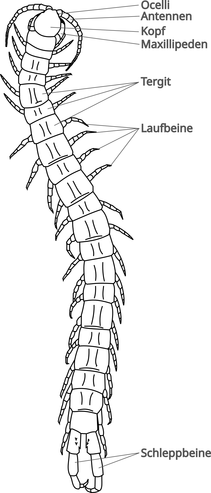
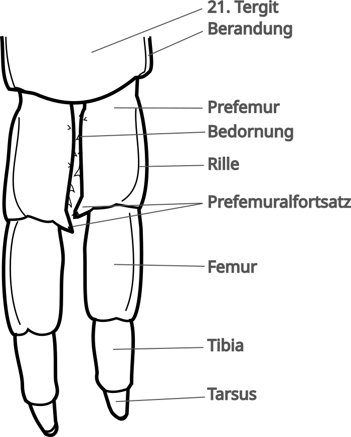

# Äußere Anatomie


An dieser Stelle wird _nur_ auf die externe Anatomie von Skolopendern eingegangen, da die interne Anatomie sehr komplex und meist für den Hobby-Halter wenig relevant ist.


Skolopender haben einen schlanken bis mäßig gedrungenen Körper, der sich in im Verhältnis zwischen Länge zu Breite zwischen Lithobiomorpha und Geophilomorpha befindet.  Die kleinsten Arten sind ca. 10mm, derweil die größten Arten deutlich über 30cm werden können.  Die Anzahl von Segmenten und Beinpaaren ist konstant. Die meisten Skolopender haben 21 Beinpaare. Dabei entspringt aus jedem Körpersegment ein Beinpaar, was den Unterschied zu den Diplopoda ausmacht, die verbundene Segmente haben, aus denen jeweils 2 Beinpaare entspringen.

Der Kopf eines Skolopenders besteht aus dem dorsalen **Kopfschild** und den ventralen **Clypeus** (_Stirnplatte_) und dem **Kopfpleurit**. Vorne befinden sich die **Antennen**, deren Grundglieder häufig kahl sind. Meist bestehen die Antennen aus 17 kugelförmigen Gliedern. Seitlich vorne, etwas hinter den Antennen, befinden sich die 4 **Ocellen** (_Augen_).
Ventral befinden sich am Kopf die **Mandibeln** (zum _Mundwerkzeug_ umgewandeltes 3. Beinpaar) und **Maxillen** (_Mundwerkzeuge_). Diese sind meist von den **Maxillipeden** (_Kieferfüße_) überdeckt. Diese vermeintlichen Mundwerkzeuge sind umgewandelte Beine, in denen auch die Giftdrüsen von Skolopendern sitzen. Ein "Biss" ist eigentlich kein Biss im wörtlichen Sinne, sondern ein "Greifen" mit den Giftklauen.

Die **Maxillipeden** werden nicht zu den Beinpaaren gezählt. Neben den 20 Laufbeinen haben Skolopender als 21. Beinpaar die sogenannten **Schleppläufe** oder Endbeine, die nicht zur Fortbewegung dienen. Sie erfüllen andere Zwecke, wie Feindabwehr oder auch Kommunikation in der Paarung. Manche Arten verfügen über sogenannte Autonomie und können die Schleppbeine bei Bedrohung abwerfen oder Stridulationsgeräusche damit verursachen.

Die Laufbeine entspringen aus der **Coxopleura** (_Hüft-Pleura_). Das erste Segment nach der **Coxa** (_Hüfte_) ist das **Prefemur**, gefolgt von **Femur**, **Tibia** (_Schienbein_), **Tarsus** (_Fuß_) und **Pretarsus**, an dem die **Klauen** ansetzen. Neben der Klaue gibt es noch den **Klauensporn**, der parallel zur Klaue aus dem Pretarsus entspringt.

Auf der Rückseite schützen **Tergite** (_Rückenplatten_) einen Skolopender. Auf der Bauchseite die **Sternite** (_Brustplatten_). Sowohl Tergite wie auch Sternite sind aus einem harten Chitin-Panzer und somit unbeweglich. Darum müssen sich Hundertfüßer häuten um zu wachsen.  
Seitlich werden Tergit und Sternit durch die **Pleura** verbunden. In dieser flexiblen Hautschicht befinden sich auch die **Stigmen**. Dies sind Öffnungen in das **Tracheen**-System, mit dem ein Skolopender atmet. Diese Öffnungen kann mit "Ventilklappen" verschlossen und eher dreieckig geformt (Scolopendrinae) oder ohne Klappen und eher oval bis rund sein (Otostigminae).

Am letzten Körpersegment haben Skolopender ein verhärtetes **Coxolpleura** mit langgezogenen Fortsätzen, den **Coxopleurenfortsätzen**. Diese können mitunter eine Bedornung aufweisen, die für die Artbestimmung wichtig ist.

In der Vergangenheit wurden oft unterschiedliche Begriffe in den Artenbeschreibungen verwendet, die zuweilen ungenau, falsch oder irreführend waren. Auch waren viele der ersten Artenbeschreibungen lediglich auf deutsch verfasst. Innerhalb der englischen Wissenschaften wurden deswegen einige Begriffe als Empfehlung harmonisiert.[^2]



dorsale (rückseitige) Ansicht Scolopendra

<--->

ventrale (vorderseitige) Detailansicht Kopf Scolopendra 

dorsaler (rückseitige) Detailansicht Kopf Scolopendra 





dorsale (rückseitige) Detailansicht Schleppbeine  
Scolopendra morsitans

<--->

ventrale (vorderseitige) Detailansicht Schleppbeine  
Scolopendra morsitans



[^2]: [2010 - Edgecombe et. al. - "A common terminology for the external anatomy of centipedes (Chilopoda)"](https://www.ncbi.nlm.nih.gov/pmc/articles/PMC3088443/)