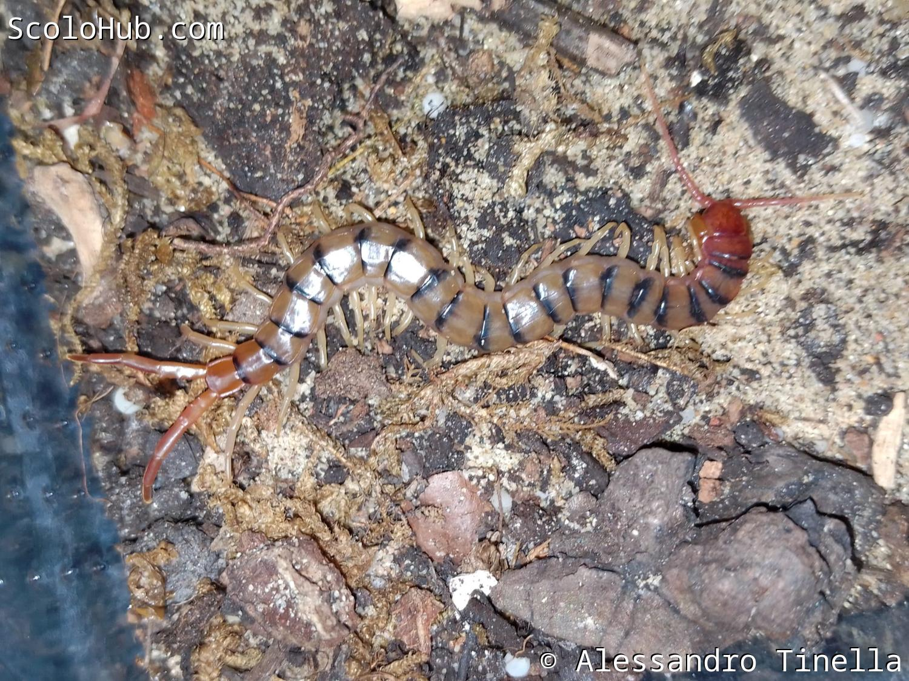

# Artbestimmung bei Skolopendern

Artbestimmung bei Skolopendern ist kein triviales Thema. Man kann nicht einfach über Farbgebung oder Herkunft die genaue Art ermitteln, sondern muss mitunter auf kleine Details achten, die häufig in Relation gesetzt werden müssen.  

Derweil eine Ringfurche auf dem ersten Tergit bei südamerikanischen Tieren recht verbreitet ist, ist dies für **Scolopendra valida** aus der alten Welt ein relativ eindeutiges Erkennungsmerkmal. Andere Arten sind in der Morphologie fast deckungsgleich und man muss die Klauensporne an den Füßen oder die Bedornung der Prefemur der Schleppbeine untersuchen. Andere Arten, die kosmopolitisch sind und vielgestaltig auftreten (z.B. **Scolopendra polymorpha** oder **Scolopendra morsitans**), haben sogar innerhalb ihrer Art starke Abweichungen. Manchmal basierend auf der Herkunft, manchmal aber auch als schlichte Variation innerhalb der Art. Lediglich bei **Scolopendra hardwickei** kann man auf Grund des Farbmusters schnell und einfach die Art bestimmen.[^5] Wobei es bei morphologische Variationen von **Scolopendra hardwickei** wieder komplizierter wird.

Hinzu kommt jedoch, dass sehr viele Skolopender noch gar nicht beschrieben wurden und entsprechend keinen offiziellen Namen haben. Das populärste Beispiel ist hier sicherlich der "Malaysian Jewel", der noch keinen wissenschaftlichen Namen hat, aber bereits seit 2008 in der Hobbyhaltung bekannt ist. Oder auch der berühmte "White Legs", der bereits als "Scolopendra gigantea" oder "Scolopendra robusta" im Hobby vorhanden war, aber so viele morphologische Unterschiede zu beiden Arten aufweist, dass es definitiv eine andere, bisher unbeschriebene Art ist.

Auch passiert es nicht selten, dass Skolopender unter falschem Namen angeboten werden. Gelegentlich passiert das bewusst, um dem Käufer eine seltene Art zu suggerieren, häufig basiert es jedoch schlicht auf Unwissenheit des Verkäufers. Hundertfüßer sind und bleiben einfach eine Nische im Hobby, mit der sich wenige Leute intensiv beschäftigen. Umso wichtiger ist es für jeden ambitionierten Hobbyhalter, dass er sich selber mit Taxonomie und den morphologischen Beschreibungen der Arten auseinander setzt.

**Beispiel für die kleinen Details, die Artbestimmung bei Skolopendern so schwierig machen**


Scolopendra morsitans

<--->

Scolopendra pomacea



Auf den ersten Blick sehen Scolopendra polymorpha und Scolopendra pomacea sehr ähnlich aus. Der größte Unterschied ist jedoch die Ringfurche, die bei S. polymorpha abwesend ist. Weiterhin sind die Schleppbeine ein Unterschied. S. polymorpha beginnen recht dünn, werden dann jedoch "keulenartig". S. pomacea hat hingegen lange und dünne Endbeine.

[^5]: Lewis, 2010: "A key and annotated list of the Scolopendra species of the Old World with a reappraisal of Arthrorhabdus (Chilopoda: Scolopendromorpha: Scolopendridae)"
