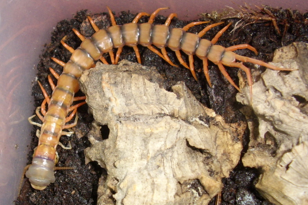

# Lebensweise

## Einzelgänger

Die Riesenläufer sind in der Regel Einzelgänger. Versuche, sie zu paaren, führen oft nicht zum Erfolg, sondern enden in Kannibalismus, selbst wenn die Geschlechter klar unterschieden sind. Es gibt auch Fälle von Pädophagie, bei denen das Muttertier seine Jungen frisst und umgekehrt, bei denen die Jungen südamerikanischer Arten ihre Mutter fressen.

Daher ist es ratsam, Skolopender immer einzeln zu halten!

Es gibt allerdings auch Ausnahmen. Es gibt Berichte von Haltern, die __Rhysida longipes__ oder __Scolopendra multidens__ erfolgreich in Gemeinschaftshaltung gehalten haben, Kronmüller spricht bei __Scolopendra canidens__ mit Abstrichen von kommunaler Haltungsform[^3].

## Bodenbewohnend, semiaquatisch, arboreal

Hundertfüßer sind in der Regel Bodenbewohner, was sich in gebräuchlichen Namen wie Erdläufer und Steinläufer widerspiegelt. Diese Arten sind hauptsächlich im Erdboden oder unter Steinen zu finden. Riesenläufer aus der Gattung Scolopendromorpha leben meist versteckt am oder im Boden, und Arten wie Rhysida longipes verbringen den Großteil ihrer Zeit vergraben im Erdreich.

Es gibt jedoch Ausnahmen. Einige Arten wie __Scolopendra dehaani__ leben zwar hauptsächlich versteckt am Boden und graben gerne, klettern aber auch gerne. Scolopendra gigantea lässt sich bei seinen Raubzügen von Höhlendecken hängen, um Fledermäuse im Flug zu erbeuten. __Scolopendra subcrustalis__ lebt sogar hauptsächlich in Bäumen, also arboreal[^2009-kronmuller].

In jüngerer Zeit wurden auch semiaquatische Arten entdeckt, die sich gerne und häufig im Wasser aufhalten, wie zum Beispiel __Scolopendra cataracta__ oder __Scolopendra paradoxa__[^2018-domenech].

Durch die weite Verbreitung von Hundertfüßer über alle Regionen, außer der Antarktis, ist diese Klasse äußerst vielfältig und anpassungsfähig. Daher sollte man in der Terrarienhaltung von Skolopendern auf die Herkunft und damit verbundenen Anforderungen der jeweiligen Art achten.

## Jagdverhalten

Hundertfüßer sind bekannt für ihr umgewandeltes erstes Beinpaar, das als Giftklauen, auch Maxilipeden genannt, dient. Sie nutzen diese Klauen, um Gift in ihre Beute zu injizieren, das sowohl zur außerkörperlichen Verdauung als auch zur Lähmung und Tötung ihrer Beute beiträgt.

Ihr Jagdverhalten ist vielfältig und reicht von stillen Lauerangriffen bis hin zu aktiven Beutezügen. Ein bekanntes Beispiel ist __Scolopendra gigantea__, der sich von Höhlendecken herabhängen lässt und Fledermäuse im Flug erbeutet[^2005-molinari]. Ähnliches Verhalten wurde auch bei __Scolopendra alternans__ beobachtet.

Obwohl die Nahrung von Skolopendern hauptsächlich aus anderen Wirbellosen wie Grillen, Spinnen und Schaben besteht, gibt es Berichte über die Erbeutung von Wirbeltieren, einschließlich Mäusen, Fröschen[^2007-forti][^1984-carpenter], Echsen[^2020-deimezis] und Schlangen[^2017-scienceealert]. Es gibt sogar Gerüchte, dass der “Goat Killer” __Scolopendra alternans__ aus Hispaniola junge Ziegen töten würde, obwohl wissenschaftliche Beweise dafür noch ausstehen. Im Gegensatz dazu ist bekannt, dass der semiaquatische __Scolopendra paradoxa__ aktiv nach Garnelen und Krabben jagt[^2018-domenech].

Nichtsdestotrotz gab es bereits 1933 Beobachtungen an __Scolopendra subspinipes__, dass Hundertfüßer auch Obst nicht abgeneigt sind[^1933-lawrence].

## Paarung

Das Paarungsritual von Hundertfüßern kann bis zu 14 Stunden andauern[^3]. Dabei durchläuft die Paarung verschiedene Phasen[^3]:

"
>}}

**Kontaktaufnahme**: Männchen und Weibchen betrillern sich gegenseitig mit Antennen und Schleppläufen.

**Imponiergehabe**: Das Männchen unterkriecht das weibchen, bis der Kopf des Weibchens die Schleppbeinde des Männchens berührt.

**Netzbau**: Das Männchen baut mit seinem Spinngriffel ein Spermanetz. Dazu benötigt es ein geeignetes Versteck wie ein Stück Korkrinde, oder es gräbt sich einen unterirdischen Bau für sein Netz.

**Ablage der Spamatophore**: Das Männchen legt sein Spermapaket in das soeben gesponnene Netz.

**Übertragung der Spermatophore**: Das Männchen macht Platz im Versteck für das Weibchen. Es hält weiterhin Kontakt zum Weibchen, vornehmlich über die Antennen, damit das Weibchen nicht das Spermapaket frist, sondern mit den Geschlechtsorganen aufnimmt.

"
>}}

Derweil viele Scolopendra diesen Akt der kontaktlosen Befruchtung praktizieren, ist eine direkte Befruchtung bei Ethmostigmus-Arten nicht unüblich.

## Häutung und Wachstum

Im ersten Nymphenstadium haben junge Skolopender, auch Pedelings genannt, keinen festen Chitinpanzer. Zu diesem Zeitpunkt sollten die Tiere jedoch auch noch nicht von der Mutter separiert werden. Später entwickelt sich ein fester Chitinpanzer an den Tergiten und Sterniten. Obwohl die Pleura zwischen diesen Platten elastisch ist, muss sich der Hundertfüßer häuten um zu wachsen.
Nach der erfolgreichen Häutung frisst ein Skolopender seine Haut (__Exuvie__), da sie ihm wertvolle Nährstoffe liefert, die er nach der körperlichen Anstrengung und zur Aushärtung der neuen Panzerung braucht. Aus diesem Grund bekommt man als Halter vielleicht gar nicht mit, ob sich ein Tier gehäutet hat. Aber im Vorfeld gibt es bereits deutliche Anzeichen: Die Färbung des Hundertfüßers wird blass und fahl, weil sich Luft zwischen der alten und neuen Haut ansammelt. Auch kleine Verhaltensänderungen, wie die Verweigerung von Futter, können Anzeichen für eine anstehende Häutung sein.[^3] Nach der Häutung hat der Pflegling wieder kräftige Farben und ein merklich größeres Körpervolumen.

Bei der Häutung haben Skolopender zwei Besonderheiten. Zum einen können sie, wie eine Vielzahl anderer Arthropoden auch, verlorene Gliedmaßen bei der Häutung regenerieren.[^4] Zum anderen gehen Spermien begatteter Weibchen durch den Häutungsprozess nicht verloren, im Gegensatz zu beispielsweise Vogelspinnen. Daher können diese auch nach der Häutung befruchtete Eier legen.[^3]



<--->


_Scolopendra dehaani "Cherry Red" Pedeling während der Häutung_

## Vermehrung und Aufzucht

Auch ohne bekannte Verpaarung können Wildfänge in Gefangenschaft auf einmal Nachwuchs bekommen. Das liegt zum einen daran, dass befruchtete Skolopender das Sperma auch nach der Häutung noch in sich tragen. Zum anderen können Hundertfüßer prinzipiell sehr lange das Sperma speichern und unzählige Faktoren bestimmen die schlussendliche Eiablage: Klima, Nahrungsangebot, Gesundheitszustand, etc.[^3]

Während Vertreter der Gattung Scolopendra sich versteckten und sichzur Brutpflege um die Eier wickeln, kann Alipes die Eier und Jungtiere mit einigen der Laufbeine halten und weiterhin agil durch das Terrarium streifen. Ethmostigmus wiederum betreibt stationäre Brutpflege, nimmt seinen
Nachwuchs bei Störung jedoch auf die Suche nach einem neuen Unterschlupf aktiv mit. Doch egal welche Gattung man hält, während der Brutpflege sollten die Tiere so wenig wie möglich gestört werden, damit die Aufzucht erfolgreich wird. Wenn die Mutter die Eier oder Nymphen verlässt, sterben diese sehr schnell ab. Gleichsam kann Störung auch in Kannibalismus enden. Darum: Lieber die Mutter mit den Kindern in Ruhe lassen!

Wenn die Jungtiere eigenständig im Terrarium laufen, sollte man sie noch einige Zeit bei der Mutter lassen, bevor man sie trennt. Die Pedelings können dann noch mehrere Tage und Wochen zusammen gehalten werden, bis man sie separieren muss.[^3]

Dabei gibt es noch einen wichtigen Unterschied zwischen Skolopendern aus "der alten Welt" und südamerikanischen Arten: Bei südamerikanischen Arten dient das Muttertier selber als erste Nahrung für ihre Jungen. Eine Nachzucht bedeutet also zwangsweise den Verlust des Muttertiers. Dieses Verhalten zeigen keine Hundertfüßer aus Europa, Afrika oder Asien.

[^3]: 2013 - Kronmüller - "Hundertfüßer"
[^4]: [2009 - Schläfer - "Sex determination of living centipedes"](https://hochzeitsfotograf-reneschlaefer.de/Latrodecta_Scolopendomorpha_englisch_30_11_09-2.pdf)
[^2020-deimezis]: 2020 - Deimezis-Tsikoutas, Kapsalas, Pafilis - A rare case of saurophagy by Scolopendra cingulata in the central Aegean Archipelago: A role for insularity?
[^2005-molinari]: 2005 - Molinari - Predation by Giant Centipedes, Scolopendra gigantea, on Three Species of Bats in a Venezuelan Cave
[^2007-forti]: 2007 - Forti, Fischer, Encarnação - Treefrog Dendropsophus elegans (Wied-Neuwied, 1824) (Anura: Hylidae) as a meal to Otostigmus tibialis Brölemann, 1902 (Chilopoda: Scolopendridae) in the Tropical Rainforest in southeastern Brazil
[^2017-scienceealert]: [2017 - sciencealert.com - Yes, That Is a Giant Centipede Eating a Whole Snake Because Why Not](https://www.sciencealert.com/giant-centipede-eats-whole-snake-while-it-was-laying-eggs)
[^1933-lawrence]: 1933 - Lawrence - Notes on the Feeding Habits of Scolopendra subspinipes
[^2018-domenech]: 2018 - Domenech, Barbera, Larriba - A phylogenetic approach to the Philippines endemic centipedes of the genus Scolopendra Linnaeus, 1758 (Scolopendromorpha, Scolopendridae), with the description of a new species
[^2009-kronmuller]: 2009 - Kronmüller - A new species of Scolopender from the Philippines: Scolopendra subcrustalis
[^1984-carpenter]: 1984 - Carpenter, Gillingham - Giant centipede (Scolopendra alternans) attacks marine toad (Bufo marinus)
