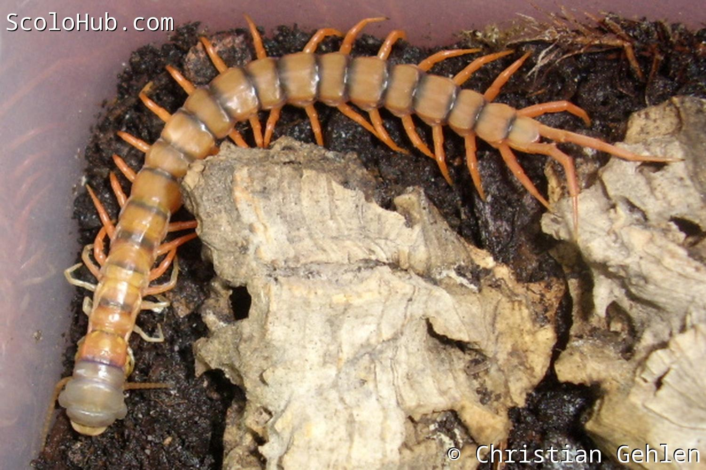
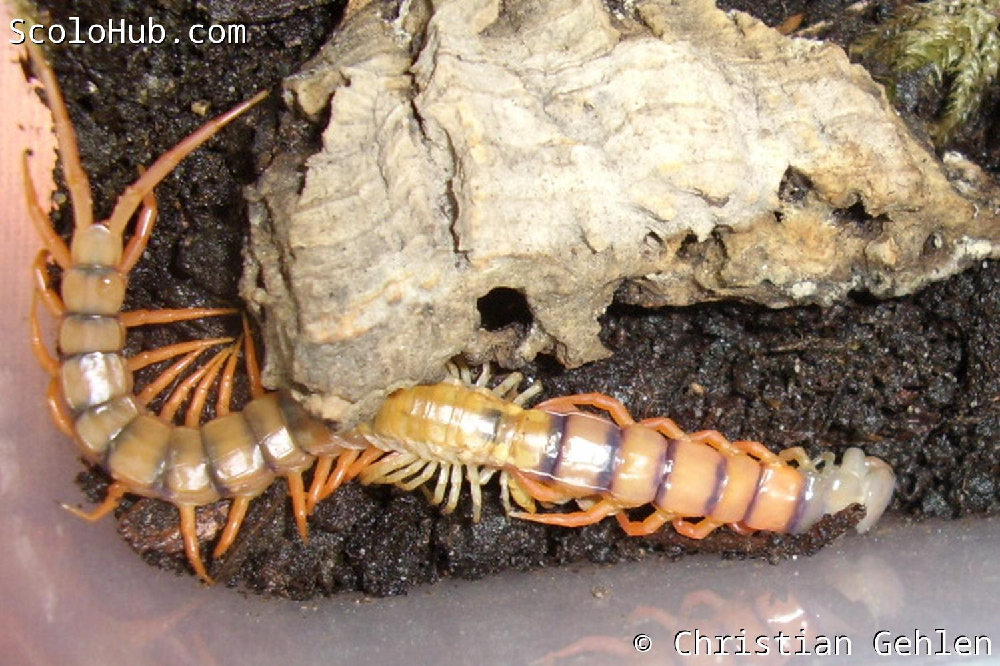

# Lebensweise

## Einzelgänger

## Bodenbewohnend, semiaquatisch, arboreal

## Jagdverhalten

## Paarung

## Häutung und Wachstum

Im ersten Nymphenstadium haben junge Skolopender, auch Pedelings genannt, keinen festen Chitinpanzer. Zu diesem Zeitpunkt sollten die Tiere jedoch auch noch nicht von der Mutter separiert werden. Später entwickelt sich ein fester Chitinpanzer an den Tergiten und Sterniten. Obwohl die Pleura zwischen diesen Platten elastisch ist, muss sich der Hundertfüßer häuten um zu wachsen.

Nach der erfolgreichen Häutung frisst ein Skolopender seine Haut (Exuvie), da sie ihm wertvolle Nährstoffe liefert, die er nach der körperlichen Anstrengung und zur Aushärtung der neuen Panzerung braucht. Aus diesem Grund bekommt man als Halter vielleicht gar nicht mit, ob sich ein Tier gehäutet hat. Aber im Vorfeld gibt es bereits deutliche Anzeichen: Die Färbung des Hundertfüßers wird blass und fahl, weil sich Luft zwischen der alten und neuen Haut ansammelt. Auch kleine Verhaltensänderungen, wie die Verweigerung von Futter, können Anzeichen für eine anstehende Häutung sein.[^3] Nach der Häutung hat der Pflegling wieder kräftige Farben und ein merklich größeres Körpervolumen.

Bei der Häutung haben Skolopender zwei Besonderheiten. Zum einen können sie, wie eine Vielzahl anderer Arthropoden auch, verlorene Gliedmaßen bei der Häutung regenerieren.[^4] Zum anderen gehen Spermien begatteter Weibchen durch den Häutungsprozess nicht verloren, im Gegensatz zu beispielsweise Vogelspinnen. Daher können diese auch nach der Häutung befruchtete Eier legen.[^3]



<--->


_Scolopendra dehaani "Cherry Red" Pedeling während der Häutung_

## Vermehrung und Aufzucht

Auch ohne bekannte Verpaarung können Wildfänge in Gefangenschaft auf einmal Nachwuchs bekommen. Das liegt zum einen daran, dass befruchtete Skolopender das Sperma auch nach der Häutung noch in sich tragen. Zum anderen können Hundertfüßer prinzipiell sehr lange das Sperma speichern und unzählige Faktoren bestimmen die schlussendliche Eiablage: Klima, Nahrungsangebot, Gesundheitszustand, etc.[^3]

Während Vertreter der Gattung Scolopendra sich versteckten und sichzur Brutpflege um die Eier wickeln, kann Alipes die Eier und Jungtiere mit einigen der Laufbeine halten und weiterhin agil durch das Terrarium streifen. Ethmostigmus wiederum betreibt stationäre Brutpflege, nimmt seinen
Nachwuchs bei Störung jedoch auf die Suche nach einem neuen Unterschlupf aktiv mit. Doch egal welche Gattung man hält, während der Brutpflege sollten die Tiere so wenig wie möglich gestört werden, damit die Aufzucht erfolgreich wird. Wenn die Mutter die Eier oder Nymphen verlässt, sterben diese sehr schnell ab. Gleichsam kann Störung auch in Kannibalismus enden. Darum: Lieber die Mutter mit den Kindern in Ruhe lassen!

Wenn die Jungtiere eigenständig im Terrarium laufen, sollte man sie noch einige Zeit bei der Mutter lassen, bevor man sie trennt. Die Pedelings können dann noch mehrere Tage und Wochen zusammen gehalten werden, bis man sie separieren muss.[^3]

Dabei gibt es noch einen wichtigen Unterschied zwischen Skolopendern aus "der alten Welt" und südamerikanischen Arten: Bei südamerikanischen Arten dient das Muttertier selber als erste Nahrung für ihre Jungen. Eine Nachzucht bedeutet also zwangsweise den Verlust des Muttertiers. Dieses Verhalten zeigen keine Hundertfüßer aus Europa, Afrika oder Asien.

[^3]: Kronmüller, 2013: "Hundertfüßer"

[^4]: Schläfer, 2009: "Sex determination of living centipedes"