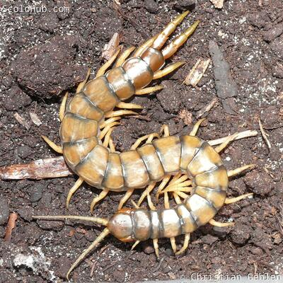
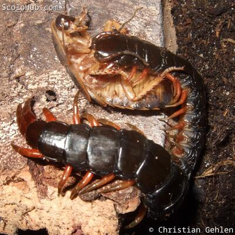

# Einstiegshilfe in die Terrarienhaltung von Skolopendern

Pinzipiell kann man mit jeder Skolopenderart in das Hobby einsteigen, auch wenn man zuvor keinerlei Erfahrung in der Terraristik hat. Man sollte sich vorher nur über die individuellen Bedürfnisse der jeweiligen Art informieren und gerade als Neuling deutlich mehr Vorsicht und Respekt vor dem Tier walten lassen. Mit der Zeit bekommt man dann recht schnell ein gutes Gespür für Details wie Fütterungsintervalle und das Temperament des Schützlings.

Dennoch sind einige Arten besonders empfehlenswert für den Einstieg in die Terrarienhaltung von Hundertfüßern.

## Geeignet Arten für den Einstieg in die Skolopenderhaltung

### Scolopendra cingulata

Der europäische Riesenläufer, so der Trivialname von **Scolopendra cingulata**, ist im gesamten Mittelmeerraum verbreitet. Man findet die Art im europäischen Südland, mittlerweile sogar in Österreich und Ungarn, sowie dem westlichen Asien und nördlichen Afrika. Durch die weite Verbreitung finden sich immer wieder Wildfänge bei einschlägigen Händlern oder auf Terraristikbörsen. Auch wurde die Art schon in Gefangenschaft nachgezüchtet, was sie insgesamt gut verfügbar macht.

Die weite Verbreitung sorgt für eine vielzahl an morphologischen Variationen. Es gibt verschiedene Färbungen und Farbmuster und auch die Größe variiert je nach Herkunft. So sind die kleinsten Arten ca. 8cm lang, derweil die größten Wildfunde bis zu 15cm werden. Tiere in Gefangenschaft erreichten sogar deutlich über 18cm.

Insgesamt mögen **Scolopendra cingulata** trockenes und warmes Klima. Durch ihre mediterrane Herkunft ist die Art allerdings auch an kältere Winterperioden gewöhnt und benötigt diese sogar für eine erfolgreiche Verpaarung und Nachzucht. Je nach Herkunft empfiehlt sich ein Blick auf die entsprechenden Klimadaten, damit man die notwendige Temperaturabsenkung in den Wintermonaten gewährleisten kann. Einige Arten lassen sich aber durchaus permanent bei plausibler Zimmertemperatur halten.



Scolopendra cingulata aus Athen
<--->

Scolopendra cingulata aus Israel


### Ethmostigmus trigonopodus pygomenasoides


Aktuell sind viele Wildfänge von **Ethmostigmus trigonopodus pygomenasoides** im Umlauf. Oftmals werden jedoch andere Handelsnamen angegeben, von simpel Ethmostigmus trigonopodus oder Ethmostigmus pygomenasoides hin zu "Ethmostigmus Niger" oder "Ethmostigmus Orange Legs". Taxonomisch ist es jedoch eine Unterart von Ethmostigmus trigonopodus, die den Namen trägt, weil sie dem Indischen Ethmostigmus pygomegas ähnlich sieht.  
Viele der Wildfänge kommen bereits befruchtet in das Hobby, sodass es auch eine solide Zahl an Nachwuchs gibt. Weiterhin wurde die Art auch schon erfolgreich im Hobby nachgezüchtet, sodass man aktuell eine stabile Verfügbarkeit hat, und die Art recht erschwinglich ist.

**Ethmostigmus trigonopodus pygomenasoides** ist in weiten Teilen Afrikas verbreitet und kommt entsprechend in unterschiedlichen Klimazonen vor. Entsprechend robust sind sie auch gegen kleinere Haltungsfehler. Man kann die Art auch schon mal was trockener halten, ohne dass sie direkt eingeht. Allerdings sollte man Ethmostigmus trigonopodus pygomenasoides keinesfalls wie einen Wüstenbewohner halten! Das Substrat sollte sogar leicht feucht sein.

Auch ansonsten ist die Art sehr pflegeleicht, frisst gerne und viel und zeigt sich in der Dämmerung gerne an der Oberfläche. Tagsüber ist sie meist versteckt unter der bereitgestellten Korkrinde. Wenn man diese anhebt, hängt der Skolopender meist kopfüber an der Rinde.

Erwachsene Tiere erreichen eine Größe von ca. 18cm. Allerdings nur die Weibchen. Männliche Tiere werden nur 3 Jahre alt und erreichen in dieser Zeit eine Körperlänge von ca. 10cm. Bis die Weibchen adult sind, und ihre endgültige Größe erreicht haben, vergehen ca. 6 Jahre.

[Zur Pflegeanleitung von Ethmostigmus trigonopodus pygomenasoides.](/caresheets/ethmostigmus_trigonopodus_pygomenasoides)

### Rhysida longipes


**Rhysida longipes** ist eine kleine, kosmopolitische Art, die durch Verschleppung quasi im gesamten (sub-)tropischen Gürtel vorkommt: Von Süd-Florida, USA, Kolumbien über den Orient hin zu Vietnam. Die meisten Wildfänge wurden früher aus Afrika stetig importiert. Auch gibt es immer wieder erfolgreiche Nachzuchten im Hobby. Entsprechend ist die Art relativ gut verfügbar und hat einen vergleichsweise geringen Anschaffungspreis.

**Rhysida longipes** wird ca. 8cm lang und kann sehr einfach gehalten werden. Mancher Halter berichtet sogar von erfolgreicher kommunaler Haltung oder Haltung zusammen mit anderen Gattungen wie etwa Tausendfüßern. Leider ist dieser Skolopender sehr scheu und nervös. Meist verbringt **Rhysida longipes** die Zeit tief vergraben im Erdreich und ist maximal in der Nacht aktiv. Bei geringster Störung flüchtet die Art gar panisch.

[Zur Pflegeanleitung von Rhysida longipes.](/caresheets/rhysida_longipes/)



### Scolopendra dehaani


Ob **Scolopendra dehaani** für Anfänger geeignet ist, wird regelmäßig diskutiert. In der eigentlichen Haltung ist die Art relativ einfach und besticht mit ihrer imposanten Körpergröße von deutlich über 20cm. Entsprechend sollte das Terrarium dimensioniert sein.

Die meisten Farbvariationen wie "Yellow Leg", "Orange Leg" oder "Red Leg" haben ähnliche Haltungsparameter, können gut bei Zimmertemperatur und leicht feuchtem Substrat gehalten werden. Lediglich die "Cherry Red" Variante verträgt keine hohen Temperaturen und darf nicht über 22°C gehalten werden. Doch ist diese Farbmorphe heute eh leider selten verfügbar. Die Farbvarianten "Yellow Leg" oder "Orange Leg" sind hingegen häufig als Wildfang verfügbar und erhältlich um die EUR 40.

Das Temperament von **Scolopendra dehaani** bietet im Gegensatz zu den Haltungsparametern mehr Grund zur Diskussion: Die Art ist tendenziell eher aggressiv, sehr schnell und kann sogar springen. Als Anfänger sollte man hier durchaus Vorsicht walten lassen und nie mit den Händen im Terrarium arbeiten. Eine Pinzette mit ca. 30cm sorgt hier für den nötigen Sicherheitsabstand. Bei guter Haltung und Ernährung ist die Art jedoch relativ umgänglich und durchaus auch für Einsteiger geeignet.



[Zur Pflegeanleitung für Scolopendra dehaani "Cherry Red"](/caresheets/scolopendra_dehaani/cherry_red/)

[Zur Pflegeanleitung für Scolopendra dehaani "Yellow Leg" und "Orange Leg"](/caresheets/scolopendra_dehaani/leg_morphs/)
